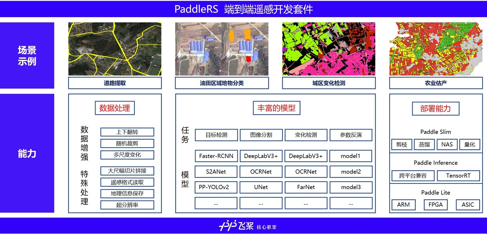
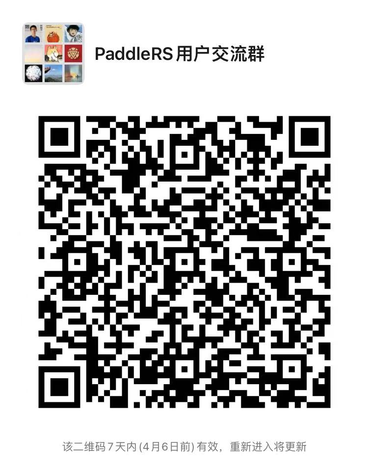

# PaddleRS

<div align="center">

<p align="center">
  
</p>

**飞桨高性能遥感图像处理开发套件，端到端地完成从训练到部署的全流程遥感深度学习应用。**

<!-- [](https://travis-ci.org/PaddlePaddle/PaddleSeg) -->
<!-- [](https://github.com/PaddlePaddle/PaddleSeg/releases) -->
[](LICENSE)


</div>


## 最新动态 

* [2022-03-30] PaddleRS alpha版本发布！详细发版信息请参考[Release Note](https://github.com/PaddleCV-SIG)。

## 简介

PaddleRS是xxx、xxx、xxx等遥感科研院所共同基于飞桨开发的遥感处理平台，支持遥感图像分类，目标检测，图像分割，以及变化检测等常用遥感任务，帮助开发者更便捷地完成从训练到部署全流程遥感深度学习应用。

<div align="center">
  
</div>


----------------
## 特性 


*  **特有的遥感数据处理模块**：针对遥感行业数据特点，提供了大尺幅数据切片与拼接，支持读取`tif`, `png`, `jpeg`, `bmp`, `img`, `npy`.
等格式，支持地理信息保存和超分辨率。

*  **覆盖任务广**：支持目标检测、图像分割、变化检测、参数反演等多种任务

*  **高性能**：支持多进程异步I/O、多卡并行训练、评估等加速策略，结合飞桨核心框架的显存优化功能，可大幅度减少分割模型的训练开销，让开发者更低成本、更高效地完成图像遥感图像的开发和训练。

----------

## 技术交流 

* 如果你发现任何PaddleRS存在的问题或者是建议, 欢迎通过[GitHub Issues](https://github.com/PaddleCV-SIG/PaddleRS/issues)给我们提issues。
* 欢迎加入PaddleRS 微信群
<div align="center">
  
</div>

## 使用教程 

* [快速上手PaddleRS](./tutorials/train/README.md)
* 准备数据集
   * [遥感数据](./docs/data/rs_data_cn.md)
   * [智能标注工具EISeg](https://github.com/PaddlePaddle/PaddleSeg/tree/release/2.4/EISeg)

   * [遥感数据处理脚本](./docs/tools.md)


## 许可证书

本项目的发布受Apache 2.0 license许可认证。

## 贡献说明 

本项目的发布受Apache 2.0 license许可认证。

## 学术引用 

如果我们的项目在学术上帮助到你，请考虑以下引用：

```latex
@misc{liu2021paddleseg,
      title={PaddleSeg: A High-Efficient Development Toolkit for Image Segmentation},
      author={Yi Liu and Lutao Chu and Guowei Chen and Zewu Wu and Zeyu Chen and Baohua Lai and Yuying Hao},
      year={2021},
      eprint={2101.06175},
      archivePrefix={arXiv},
      primaryClass={cs.CV}
}

@misc{paddleseg2019,
    title={PaddleSeg, End-to-end image segmentation kit based on PaddlePaddle},
    author={PaddlePaddle Authors},
    howpublished = {\url{https://github.com/PaddlePaddle/PaddleSeg}},
    year={2019}
}
```
