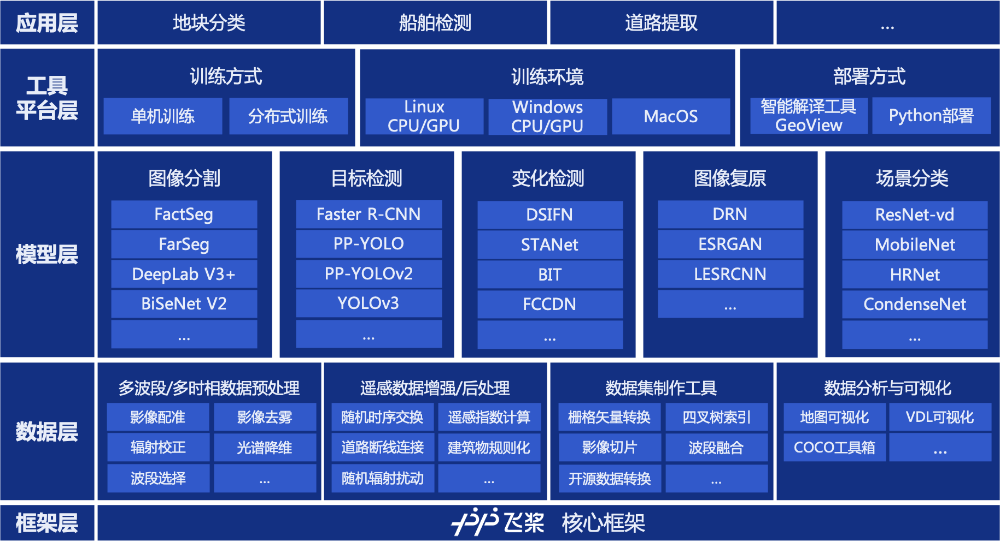

<div align="center">
  <p align="center">
    
  </p>

  **飞桨高性能遥感影像开发套件，端到端完成从数据到部署的全流程遥感应用。**

  <!-- [](https://github.com/PaddlePaddle/PaddleRS/releases) -->
  [](LICENSE)
  [](https://github.com/PaddlePaddle/PaddleRS/actions)
  
  
</div>

## 最新动态 

*  [2022-05-19] 🔥 PaddleRS发布1.0-beta版本，全面支持遥感领域深度学习任务。详细发版信息请参考[Release Note](https://github.com/PaddlePaddle/PaddleRS/releases)。

## 简介

PaddleRS是百度飞桨、遥感科研院所及相关高校共同开发的基于飞桨的遥感影像智能化处理套件，支持图像分割、目标检测、场景分类、变化检测以及图像复原等常见遥感任务。PaddleRS致力于帮助遥感领域科研从业者快速完成算法的研发、验证和调优，以及帮助投身于产业实践的开发者便捷地实现从数据预处理到模型部署的全流程遥感深度学习应用。

<div align="center">
  
</div>

## 特性 

PaddleRS具有以下五大特色：

*  **丰富的视觉与遥感特色模型库**：集成飞桨四大视觉套件的成熟模型库，同时支持FarSeg、BIT、ChangeStar等众多遥感领域深度学习模型，覆盖图像分割、目标检测、场景分类、变化检测、图像复原等任务。

*  **对遥感领域专有任务的支持**：支持包括变化检测在内的遥感领域特色任务，提供完善的训练、部署教程以及丰富的实践案例。

*  **针对遥感影像大幅面性质的优化**：支持大幅面影像滑窗推理，使用内存延迟载入技术提升性能；支持对大幅面影像地理坐标信息的读写。

*  **顾及遥感特性与地学知识的数据预处理**：针对遥感数据特点，提供对包含任意数量波段的数据以及多时相数据的预处理功能，支持影像配准、辐射校正、波段选择等遥感数据预处理方法。

*  **工业级训练与部署性能**：支持多进程异步I/O、多卡并行训练等加速策略，结合飞桨核心框架的显存优化功能，可大幅度减少模型的训练开销，帮助开发者以更低成本、更高效地完成遥感的开发和训练。

## 产品矩阵

<table align="center">
  <tbody>
    <tr align="center" valign="bottom">
      <td>
        <b>模型总览</b>
      </td>
      <td>
        <b>数据增强</b>
      </td>
      <td>
        <b>遥感工具</b>
      </td>
      <td>
        <b>实践案例</b>
      </td>
    </tr>
    <tr valign="top">
      <td>
        <b>场景分类</b><br>
        <ul>
          <li>ResNet50-vd</li>
          <li>MobileNetV3</li>
          <li>HRNet</li>
        </ul>
        <b>语义分割</b><br>
        <ul>
          <li>UNet</li>
          <li>FarSeg</li>
          <li>DeepLab V3+</li>
        </ul>
        <b>目标检测</b><br>
        <ul>
          <li>PP-YOLO</li>
          <li>Faster R-CNN</li>
          <li>YOLOv3</li>
        </ul>
        <b>图像复原</b><br>
        <ul>
          <li>DRNet</li>
          <li>LESRCNN</li>
          <li>ESRGAN</li>
        </ul>
        <b>变化检测</b><br>
        <ul>
          <li>DSIFN</li>
          <li>STANet</li>
          <li>ChangeStar</li>
        </ul>
      </td>
      <td>
        <b>数据增强</b><br>
        <ul>
          <li>Resize</li>  
          <li>RandomResize</li>  
          <li>ResizeByShort</li>
          <li>RandomResizeByShort</li>
          <li>ResizeByLong</li>  
          <li>RandomFlipOrRotate</li>
          <li>RandomHorizontalFlip</li>  
          <li>RandomVerticalFlip</li>
          <li>Normalize</li>
          <li>CenterCrop</li>
          <li>RandomCrop</li>
          <li>RandomScaleAspect</li>  
          <li>RandomExpand</li>
          <li>Pad</li>
          <li>MixupImage</li>  
          <li>RandomDistort</li>  
          <li>RandomBlur</li>  
          <li>Dehaze</li>  
          <li>ReduceDim</li>  
          <li>SelectBand</li>  
          <li>RandomSwap</li>
        </ul>  
      </td>
      <td>
        <b>数据格式转换</b><br>
        <ul>
          <li>coco to mask</li>
          <li>mask to shpfile</li>
          <li>mask to geojson</li>
        </ul>
        <b>数据预处理</b><br>
        <ul>
          <li>影像切片</li>
          <li>影像配准</li>
          <li>波段选择</li>
        </ul>
      </td>
      <td>
        <b>遥感场景分类</b><br>
        <ul>
          <li>待更</li>
        </ul>
        <b>遥感语义分割</b><br>
        <ul>
          <li>待更</li>
        </ul>
        <b>遥感目标检测</b><br>
        <ul>
          <li>待更</li>
        </ul>
        <b>遥感变化检测</b><br>
        <ul>
          <li>待更</li>
        </ul>
        <b>遥感影像超分</b><br>
        <ul>
          <li>待更</li>
        </ul>
      </td>  
    </tr>
  </tbody>
</table>

### 代码结构

PaddleRS目录树中关键部分如下：

```
├── deploy               # 部署相关文档与脚本
├── docs                 # 项目文档
├── paddlers  
│     ├── rs_models      # 遥感专用模型实现
│     ├── datasets       # 数据集接口实现
│     ├── models         # 视觉模型实现
│     ├── tasks          # 训练器实现
│     └── transforms     # 数据预处理/数据增强实现
├── tools                # 遥感影像处理工具集
└── tutorials
      └── train          # 模型训练教程
```

## 技术交流 

* 如果您发现任何PaddleRS存在的问题或是对PaddleRS有建议, 欢迎通过[GitHub Issues](https://github.com/PaddlePaddle/PaddleRS/issues)向我们提出。
* 欢迎加入PaddleRS微信群
<div align="center">
  
</div>

## 使用教程 

* [快速上手PaddleRS](./tutorials/train/README.md)
* 准备数据集
  * [快速了解遥感与遥感数据](./docs/data/rs_data.md)
  * [遥感数据集整理](./docs/data/dataset.md)
  * [智能标注工具EISeg](https://github.com/PaddlePaddle/PaddleSeg/tree/release/2.6/EISeg)
  * [遥感影像处理工具集](./docs/data/tools.md)
* 组件介绍
  * [数据预处理/数据增强](./docs/intro/transforms.md)
  * [模型库](./docs/intro/model_zoo.md)
* 模型训练
  * [模型训练API说明](./docs/apis/train.md)
* 模型部署
  * [模型导出](./deploy/export/README.md)
  * [Python部署](./deploy/README.md)
  * [模型推理API说明](./docs/apis/infer.md)
* 实践案例
  * [PaddleRS实践案例库](./examples/README.md)
* 代码贡献
  * [贡献指南](./docs/CONTRIBUTING.md)
  * [开发指南](./docs/dev/dev_guide.md)
  * [代码注释规范](./docs/dev/docstring.md)

## 开源贡献 

* 非常感谢国家对地观测科学数据中心、中国科学院空天信息创新研究院、北京航空航天大学、武汉大学、中国石油大学（华东）、中国地质大学、中国四维、航天宏图、中科星图、超图等单位对PaddleRS项目的贡献。注：排名不分先后。
* 非常感谢[geoyee](https://github.com/geoyee)(陈奕州), [kongdebug](https://github.com/kongdebug)(孔远杭), [huilin16](https://github.com/huilin16)(赵慧琳)等开发者对PaddleRS项目的贡献。
* PaddleRS欢迎来自开源社区的贡献。如果您想要为PaddleRS贡献源码/案例，请参考[贡献指南](./docs/CONTRIBUTING.md)。

## 许可证书

本项目的发布受[Apache 2.0 license](./LICENSE)许可认证。

## 学术引用 

如果我们的项目在学术上帮助到您，请考虑以下引用：

```latex
@misc{paddlers2022,
    title={PaddleRS, Awesome Remote Sensing Toolkit based on PaddlePaddle},
    author={PaddlePaddle Authors},
    howpublished = {\url{https://github.com/PaddlePaddle/PaddleRS}},
    year={2022}
}
```
