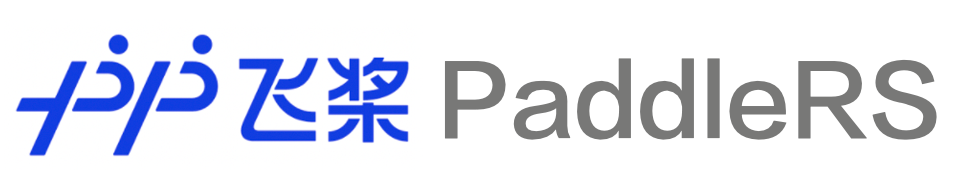
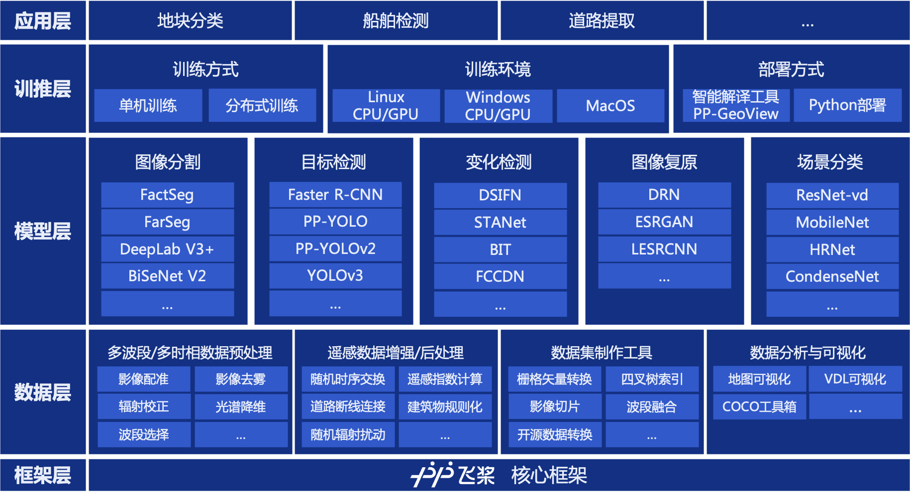

简体中文 | [English](README_EN.md)

<div align="center">
  <p align="center">
    
  </p>

  **飞桨高性能、多任务遥感影像智能解译开发套件，端到端完成从数据到部署的全流程遥感应用**

  [](https://github.com/PaddlePaddle/PaddleRS/releases)
  [](LICENSE)
  
  
</div>

##  最新动态

*  [2022-11-09] 🔥 PaddleRS发布1.0正式版本，详细发版信息请参考[Release Note](https://github.com/PaddlePaddle/PaddleRS/releases)。
*  [2022-05-19] 🔥 PaddleRS发布1.0-beta版本，全面支持遥感领域深度学习任务。详细发版信息请参考[Release Note](https://github.com/PaddlePaddle/PaddleRS/releases)。

##  简介

PaddleRS是百度飞桨、遥感科研院所及相关高校共同开发的基于飞桨的遥感影像智能解译开发套件，支持**图像分割、目标检测、场景分类、变化检测、图像复原**等常见遥感任务。PaddleRS致力于帮助遥感领域科研从业者快速完成算法的研发、验证和调优。同时，PaddleRS也期望助力投身于产业实践的开发者，便捷地实现从数据预处理到模型部署的**全流程遥感深度学习应用**。

<div align="center">
  
</div>

##  特性

PaddleRS具有以下五大特色：

*  **丰富的视觉与遥感特色模型库**：集成飞桨四大视觉套件的成熟模型库，同时支持FarSeg、BIT、ChangeStar等众多遥感领域深度学习模型，覆盖图像分割、目标检测、场景分类、变化检测、图像复原等任务。

*  **对遥感领域专有任务的支持**：支持包括变化检测在内的遥感领域特色任务，提供完善的训练、部署教程以及丰富的实践案例。

*  **针对遥感影像大幅面性质的优化**：支持大幅面影像滑窗推理，使用内存延迟载入技术提升性能；支持对大幅面影像地理坐标信息的读写。

*  **顾及遥感特性与地学知识的数据预处理**：针对遥感数据特点，提供对包含任意数量波段的数据以及多时相数据的预处理功能，支持影像配准、辐射校正、波段选择等遥感数据预处理方法，支持50余种遥感指数的提取与知识融入。

*  **工业级训练与部署性能**：支持多进程异步I/O、多卡并行训练等加速策略，结合飞桨核心框架的显存优化功能，可大幅度减少模型的训练开销，帮助开发者以更低成本、更高效地完成遥感的开发和训练。

<div align="center">
  
</div>

##  技术交流

* 如果您发现任何PaddleRS存在的问题或是对PaddleRS有建议, 欢迎通过[GitHub Issues](https://github.com/PaddlePaddle/PaddleRS/issues)向我们提出。
* 欢迎加入PaddleRS微信群：
<div align="center">
  
</div>

##  产品矩阵

<table align="center">
  <tbody>
    <tr align="center" valign="bottom">
      <td>
        <b>模型库</b>
      </td>
      <td>
        <b>数据变换算子</b>
      </td>
      <td>
        <b>遥感特色工具</b>
      </td>
      <td>
        <b>实践案例</b>
      </td>
    </tr>
    <tr valign="top">
      <td>
        <details><summary><b>变化检测</b></summary>
        <ul>
          <li><a href="./tutorials/train/change_detection/bit.py">BIT</a></li>
          <li><a href="./tutorials/train/change_detection/cdnet.py">CDNet</a></li>
          <li><a href="./tutorials/train/change_detection/changeformer.py">ChangeFormer</a></li>
          <li><a href="./paddlers/rs_models/cd/changestar.py">ChangeStar</a></li>
          <li><a href="./tutorials/train/change_detection/dsamnet.py">DSAMNet</a></li>
          <li><a href="./tutorials/train/change_detection/dsifn.py">DSIFN</a></li>
          <li><a href="./tutorials/train/change_detection/fc_ef.py">FC-EF</a></li>
          <li><a href="./tutorials/train/change_detection/fc_siam_conc.py">FC-Siam-conc</a></li>
          <li><a href="./tutorials/train/change_detection/fc_siam_diff.py">FC-Siam-diff</a></li>
          <li><a href="./tutorials/train/change_detection/fccdn.py">FCCDN</a></li>
          <li><a href="./tutorials/train/change_detection/p2v.py">P2V-CD</a></li>
          <li><a href="./tutorials/train/change_detection/snunet.py">SNUNet</a></li>
          <li><a href="./tutorials/train/change_detection/stanet.py">STANet</a></li>
        </ul>
        </details>
        <details><summary><b>场景分类</b></summary>
        <ul>
          <li><a href="./tutorials/train/classification/condensenetv2.py">CondenseNet V2</a></li>
          <li><a href="./tutorials/train/classification/hrnet.py">HRNet</a></li>
          <li><a href="./tutorials/train/classification/mobilenetv3.py">MobileNetV3</a></li>
          <li><a href="./tutorials/train/classification/resnet50_vd.py">ResNet50-vd</a></li>
        </ul>
        </details>
        <details><summary><b>图像复原</b></summary>
        <ul>
          <li><a href="./tutorials/train/image_restoration/drn.py">DRN</a></li>
          <li><a href="./tutorials/train/image_restoration/esrgan.py">ESRGAN</a></li>
          <li><a href="./tutorials/train/image_restoration/lesrcnn.py">LESRCNN</a></li>
          <li><a href="./tutorials/train/image_restoration/nafnet.py">NAFNet</a></li>
          <li><a href="./tutorials/train/image_restoration/swinir.py">SwinIR</a></li>
        </ul>
        </details>
        <details><summary><b>目标检测</b></summary>
        <ul>
          <li><a href="./tutorials/train/object_detection/faster_rcnn.py">Faster R-CNN</a></li>
          <li><a href="./tutorials/train/object_detection/fcosr.py">FCOSR</a></li>
          <li><a href="./tutorials/train/object_detection/ppyolo.py">PP-YOLO</a></li>
          <li><a href="./tutorials/train/object_detection/ppyolo_tiny.py">PP-YOLO Tiny</a></li>
          <li><a href="./tutorials/train/object_detection/ppyolov2.py">PP-YOLOv2</a></li>
          <li><a href="./tutorials/train/object_detection/yolov3.py">YOLOv3</a></li>
        </ul>
        </details>
        <details><summary><b>图像分割</b></summary>
        <ul>
          <li><a href="./tutorials/train/semantic_segmentation/bisenetv2.py">BiSeNet V2</a></li>
          <li><a href="./tutorials/train/semantic_segmentation/deeplabv3p.py">DeepLab V3+</a></li>
          <li><a href="./tutorials/train/semantic_segmentation/factseg.py">FactSeg</a></li>
          <li><a href="./tutorials/train/semantic_segmentation/farseg.py">FarSeg</a></li>
          <li><a href="./tutorials/train/semantic_segmentation/fast_scnn.py">Fast-SCNN</a></li>
          <li><a href="./tutorials/train/semantic_segmentation/hrnet.py">HRNet</a></li>
          <li><a href="./tutorials/train/semantic_segmentation/unet.py">UNet</a></li>
        </ul>
        </details>
      </td>
      <td>
        <details><summary><b>数据预处理</b></summary>
        <ul>
          <li>CenterCrop</li>
          <li>Dehaze（影像去雾）</li>
          <li>MatchRadiance（辐射校正）</li>
          <li>Normalize</li>
          <li>Pad</li>
          <li>ReduceDim（高光谱降维）</li>
          <li>Resize</li>
          <li>ResizeByLong</li>
          <li>ResizeByShort</li>
          <li>SelectBand（波段选择）</li>
          <li><a href="./docs/intro/transforms_cn.md">...</a></li>
        </ul>
        </details>
        <details><summary><b>数据增强</b></summary>
        <ul>
          <li>AppendIndex（遥感指数计算）</li>
          <li>MixupImage</li>
          <li>RandomBlur</li>
          <li>RandomCrop</li>
          <li>RandomDistort</li>
          <li>RandomExpand</li>
          <li>RandomHorizontalFlip</li>
          <li>RandomResize</li>
          <li>RandomResizeByShort</li>
          <li>RandomScaleAspect</li>
          <li>RandomSwap（随机时序交换）</li>
          <li>RandomVerticalFlip</li>
          <li><a href="./docs/intro/transforms_cn.md">...</a></li>
        </ul>
        </details>
        <details><summary><b>遥感指数</b></summary>
        <ul>
          <li>ARI</li>
          <li>ARI2</li>
          <li>ARVI</li>
          <li>AWEInsh</li>
          <li>AWEIsh</li>
          <li>BAI</li>
          <li>BI</li>
          <li>BLFEI</li>
          <li>BNDVI</li>
          <li>BWDRVI</li>
          <li>BaI</li>
          <li>CIG</li>
          <li>CSI</li>
          <li>CSIT</li>
          <li>DBI</li>
          <li>DBSI</li>
          <li>DVI</li>
          <li>EBBI</li>
          <li>EVI</li>
          <li>EVI2</li>
          <li>FCVI</li>
          <li>GARI</li>
          <li>GBNDVI</li>
          <li>GLI</li>
          <li>GRVI</li>
          <li>IPVI</li>
          <li>LSWI</li>
          <li>MBI</li>
          <li>MGRVI</li>
          <li>MNDVI</li>
          <li>MNDWI</li>
          <li>MSI</li>
          <li>NBLI</li>
          <li>NDVI</li>
          <li>NDWI</li>
          <li>NDYI</li>
          <li>NIRv</li>
          <li>PSRI</li>
          <li>RI</li>
          <li>SAVI</li>
          <li>SWI</li>
          <li>TDVI</li>
          <li>UI</li>
          <li>VIG</li>
          <li>WI1</li>
          <li>WI2</li>
          <li>WRI</li>
          <li><a href="./docs/intro/indices_cn.md">...</a></li>
        </ul>
        </details>
      </td>
      <td>
        <details><summary><b>数据格式转换</b></summary>
        <ul>
          <li><a href="./tools/coco2mask.py">COCO to mask</a></li>
          <li><a href="./tools/geojson2mask.py">GeoJSON to mask</a></li>
          <li><a href="./tools/mask2shape.py">mask to shapefile</a></li>
        </ul>
        </details>
        <details><summary><b>数据集制作</b></summary>
        <ul>
          <li><a href="./tools/extract_ms_patches.py">四叉树索引切片</a></li>
          <li><a href="./tools/match.py">影像配准</a></li>
          <li><a href="./tools/oif.py">波段选择</a></li>
          <li><a href="./tools/pca.py">波段融合</a></li>
          <li><a href="./tools/split.py">影像切片</a></li>
        </ul>
        </details>
        </details>
        <details><summary><b>数据后处理</b></summary>
        <ul>
          <li><a href="./paddlers/utils/postprocs/change_filter.py">变化检测误检点过滤</a></li>
          <li><a href="./paddlers/utils/postprocs/connection.py">道路断线连接</a></li>
          <li><a href="./paddlers/utils/postprocs/crf.py">基于条件随机场的分割结果优化</a></li>
          <li><a href="./paddlers/utils/postprocs/mrf.py">基于马尔可夫随机场的分割结果优化</a></li>
          <li><a href="./paddlers/utils/postprocs/regularization.py">建筑边界规则化</a></li>
        </ul>
        </details>
        <details><summary><b>数据可视化</b></summary>
        <ul>
          <li><a href="./paddlers/utils/visualize.py">地图-栅格可视化</a></li>
        </ul>
        </details>
        <details><summary><b>开源数据集预处理</b></summary>
        <ul>
          <li><a href="./tools/prepare_dataset/prepare_levircd.py">LEVIR-CD</a></li>
          <li><a href="./tools/prepare_dataset/prepare_svcd.py">Season-varying</a></li>
          <li><a href="./tools/prepare_dataset/prepare_ucmerced.py">UC Merced</a></li>
          <li><a href="./tools/prepare_dataset/prepare_rsod.py">RSOD</a></li>
          <li><a href="./tools/prepare_dataset/prepare_isaid.py">iSAID</a></li>
          <li><a href="./docs/intro/data_prep_cn.md">...</a></li>
        </ul>
      </td>
      <td>
      <details><summary><b>官方案例</b></summary>
      <ul>
        <li><a href="./examples/rs_research/README.md">PaddleRS科研实战：设计深度学习变化检测模型</a></li>
        <li><a href="./examples/c2fnet/README.md">基于PaddleRS的遥感图像小目标语义分割优化方法</a></li>
        <li><a href="./examples/building_extraction/README.md">建筑物提取全流程案例</a></li>
      </ul>
      </details>
      <details><summary><b>社区案例</b></summary>
      <ul>
      <li><a href="./examples/README.md">PaddleRS实践案例库</a></li>
      </ul>
      </details>
      </td>  
    </tr>
  </tbody>
</table>

##  教程与文档

* 快速上手
  * [快速上手PaddleRS](./docs/quick_start_cn.md)
* 数据准备
  * [快速了解遥感与遥感数据](./docs/data/rs_data_cn.md)
  * [开源遥感数据集汇总表](./docs/data/dataset_cn.md)
  * [智能标注工具EISeg](https://github.com/PaddlePaddle/PaddleSeg/tree/release/2.7/EISeg)
  * [遥感影像处理工具集](./docs/data/tools_cn.md)
* 组件介绍
  * [数据集预处理脚本](./docs/intro/data_prep_cn.md)
  * [模型库](./docs/intro/model_zoo_cn.md)
  * [遥感指数](./docs/intro/indices_cn.md)
  * [数据变换算子](./docs/intro/transforms_cn.md)
* [模型训练](./tutorials/train/README_CN.md)
* 模型部署
  * [模型导出](./deploy/export/README.md)
  * [Python部署](./deploy/README.md)
  * [遥感影像智能解译工具GeoView](https://github.com/PaddleCV-SIG/GeoView)
* 代码贡献
  * [贡献指南](./docs/CONTRIBUTING_CN.md)
  * [开发指南](./docs/dev/dev_guide_cn.md)
  * [代码注释规范](./docs/dev/docstring_cn.md)
  * [模型训练API说明](./docs/apis/train_cn.md)
  * [模型推理API说明](./docs/apis/infer_cn.md)

##  实践案例

* [PaddleRS科研实战：设计深度学习变化检测模型](./examples/rs_research/README.md)
* [基于PaddleRS的遥感图像小目标语义分割优化方法](./examples/c2fnet/README.md)

更多案例请参考[PaddleRS实践案例库](./examples/README.md)。

## 许可证书

本项目的发布受[Apache 2.0 license](./LICENSE)许可认证。

##  开源贡献

* 非常感谢国家对地观测科学数据中心、中国科学院空天信息创新研究院、北京航空航天大学、武汉大学、中国石油大学（华东）、中国地质大学、中国四维、航天宏图、中科星图、超图等单位对PaddleRS项目的贡献。注：排名不分先后。
* 非常感谢[geoyee](https://github.com/geoyee)(陈奕州)，[kongdebug](https://github.com/kongdebug)(孔远杭)，[huilin16](https://github.com/huilin16)(赵慧琳)等开发者对PaddleRS项目的贡献。

##  学术引用

如果我们的项目在学术上帮助到您，请考虑以下引用：

```latex
@misc{paddlers2022,
    title={PaddleRS, Awesome Remote Sensing Toolkit based on PaddlePaddle},
    author={PaddlePaddle Authors},
    howpublished = {\url{https://github.com/PaddlePaddle/PaddleRS}},
    year={2022}
}
```
