# coco_tools说明

## 0.工具说明

coco_tools是PaddleRS中，用coco类标注文件处理的工具集，详见[tools/coco_tools/](tools/coco_tools/)。

由于pycocotools库在部分环境下无法安装，因此可以使用coco_tools进行一些简单的文件处理工作。

## 1.文件说明

目前coco_tools共有6个文件，各文件及其功能如下：

* json_InfoShow:    打印json文件中各个字典的基本信息；
* json_ImgSta:      统计json文件中的图像信息，生成统计表、统计图；
* json_AnnoSta:     统计json文件中的标注信息，生成统计表、统计图；
* json_Img2Json:    统计test集图像，生成json文件；
* json_Split:       json文件拆分，划分为train set、val set
* json_Merge:       json文件合并，将多个json合并为1个json

## 2. 应用案例说明

通过本教程，你将快速学会PaddleRS中关于coco_tools的API调用，帮助你完成coco类数据集的信息统计、文件操作。

## 2.1 示例数据集

本文档以COCO 2017数据集作为示例数据，进行演示。COCO 2017 [官方下载链接](https://cocodataset.org/#download)、[aistudio备份链接](https://aistudio.baidu.com/aistudio/datasetdetail/7122)

COCO 2017 文件结构

```
./COCO2017/      # 数据集根目录
|--train2017     # 训练集原图目录
|  |--...
|  |--...
|--val2017       # 验证集原图目录
|  |--...
|  |--...
|--test2017      # 测试集原图目录
|  |--...
|  |--...
|
|--annotations   # 标注文件目录
|  |--...
|  |--...
|
|--coco_tools    # coco_tools代码目录
|  |--...
|  |--...
```

## 2.2 打印json信息

使用json_InfoShow.py，可以打印`instances_val2017.json`中的各个key， 并输出value中的前n个元素，从而帮助快速了解标注信息。

尤其是对于coco格式标注数据中的image、annotation，可以查看其具体的标注格式

### 2.2.1 命令演示

可以执行如下命令，打印`instances_val2017.json`信息

```
python ./coco_tools/json_InfoShow.py \
       --json_path=./annotations/instances_val2017.json \
       --show_num 5
```

### 2.2.2 参数说明


| 参数名      | 含义                         | 默认值 |
| ------------- | ------------------------------ | -------- |
| --json_path | 需要统计的json文件路径       |        |
| --show_num  | (可选)输出value元素的个数    | 5      |
| --Args_show | (可选)是否打印输入的参数信息 | True   |

### 2.2.3 结果展示

执行上述命令后，输出结果如下：

```
------------------------------------------------Args------------------------------------------------
json_path = ./annotations/instances_val2017.json
show_num = 5
Args_show = True

------------------------------------------------Info------------------------------------------------
json read...
json keys: dict_keys(['info', 'licenses', 'images', 'annotations', 'categories']) 

***********************info***********************
 Content Type: dict
 Total Length: 6
 First 5 record:

description : COCO 2017 Dataset
url : http://cocodataset.org
version : 1.0
year : 2017
contributor : COCO Consortium
...
...

*********************licenses*********************
 Content Type: list
 Total Length: 8
 First 5 record:

{'url': 'http://creativecommons.org/licenses/by-nc-sa/2.0/', 'id': 1, 'name': 'Attribution-NonCommercial-ShareAlike License'}
{'url': 'http://creativecommons.org/licenses/by-nc/2.0/', 'id': 2, 'name': 'Attribution-NonCommercial License'}
{'url': 'http://creativecommons.org/licenses/by-nc-nd/2.0/', 'id': 3, 'name': 'Attribution-NonCommercial-NoDerivs License'}
{'url': 'http://creativecommons.org/licenses/by/2.0/', 'id': 4, 'name': 'Attribution License'}
{'url': 'http://creativecommons.org/licenses/by-sa/2.0/', 'id': 5, 'name': 'Attribution-ShareAlike License'}
...
...

**********************images**********************
 Content Type: list
 Total Length: 5000
 First 5 record:

{'license': 4, 'file_name': '000000397133.jpg', 'coco_url': 'http://images.cocodataset.org/val2017/000000397133.jpg', 'height': 427, 'width': 640, 'date_captured': '2013-11-14 17:02:52', 'flickr_url': 'http://farm7.staticflickr.com/6116/6255196340_da26cf2c9e_z.jpg', 'id': 397133}
{'license': 1, 'file_name': '000000037777.jpg', 'coco_url': 'http://images.cocodataset.org/val2017/000000037777.jpg', 'height': 230, 'width': 352, 'date_captured': '2013-11-14 20:55:31', 'flickr_url': 'http://farm9.staticflickr.com/8429/7839199426_f6d48aa585_z.jpg', 'id': 37777}
{'license': 4, 'file_name': '000000252219.jpg', 'coco_url': 'http://images.cocodataset.org/val2017/000000252219.jpg', 'height': 428, 'width': 640, 'date_captured': '2013-11-14 22:32:02', 'flickr_url': 'http://farm4.staticflickr.com/3446/3232237447_13d84bd0a1_z.jpg', 'id': 252219}
{'license': 1, 'file_name': '000000087038.jpg', 'coco_url': 'http://images.cocodataset.org/val2017/000000087038.jpg', 'height': 480, 'width': 640, 'date_captured': '2013-11-14 23:11:37', 'flickr_url': 'http://farm8.staticflickr.com/7355/8825114508_b0fa4d7168_z.jpg', 'id': 87038}
{'license': 6, 'file_name': '000000174482.jpg', 'coco_url': 'http://images.cocodataset.org/val2017/000000174482.jpg', 'height': 388, 'width': 640, 'date_captured': '2013-11-14 23:16:55', 'flickr_url': 'http://farm8.staticflickr.com/7020/6478877255_242f741dd1_z.jpg', 'id': 174482}
...
...

*******************annotations********************
 Content Type: list
 Total Length: 36781
 First 5 record:

{'segmentation': [[510.66, 423.01, 511.72, 420.03, 510.45, 416.0, 510.34, 413.02, 510.77, 410.26, 510.77, 407.5, 510.34, 405.16, 511.51, 402.83, 511.41, 400.49, 510.24, 398.16, 509.39, 397.31, 504.61, 399.22, 502.17, 399.64, 500.89, 401.66, 500.47, 402.08, 499.09, 401.87, 495.79, 401.98, 490.59, 401.77, 488.79, 401.77, 485.39, 398.58, 483.9, 397.31, 481.56, 396.35, 478.48, 395.93, 476.68, 396.03, 475.4, 396.77, 473.92, 398.79, 473.28, 399.96, 473.49, 401.87, 474.56, 403.47, 473.07, 405.59, 473.39, 407.71, 476.68, 409.41, 479.23, 409.73, 481.56, 410.69, 480.4, 411.85, 481.35, 414.93, 479.86, 418.65, 477.32, 420.03, 476.04, 422.58, 479.02, 422.58, 480.29, 423.01, 483.79, 419.93, 486.66, 416.21, 490.06, 415.57, 492.18, 416.85, 491.65, 420.24, 492.82, 422.9, 493.56, 424.39, 496.43, 424.6, 498.02, 423.01, 498.13, 421.31, 497.07, 420.03, 497.07, 415.15, 496.33, 414.51, 501.1, 411.96, 502.06, 411.32, 503.02, 415.04, 503.33, 418.12, 501.1, 420.24, 498.98, 421.63, 500.47, 424.39, 505.03, 423.32, 506.2, 421.31, 507.69, 419.5, 506.31, 423.32, 510.03, 423.01, 510.45, 423.01]], 'area': 702.1057499999998, 'iscrowd': 0, 'image_id': 289343, 'bbox': [473.07, 395.93, 38.65, 28.67], 'category_id': 18, 'id': 1768}
{'segmentation': [[289.74, 443.39, 302.29, 445.32, 308.09, 427.94, 310.02, 416.35, 304.23, 405.73, 300.14, 385.01, 298.23, 359.52, 295.04, 365.89, 282.3, 362.71, 275.29, 358.25, 277.2, 346.14, 280.39, 339.13, 284.85, 339.13, 291.22, 338.49, 293.77, 335.95, 295.04, 326.39, 297.59, 317.47, 289.94, 309.82, 287.4, 288.79, 286.12, 275.41, 284.21, 271.59, 279.11, 276.69, 275.93, 275.41, 272.1, 271.59, 274.01, 267.77, 275.93, 265.22, 277.84, 264.58, 282.3, 251.2, 293.77, 238.46, 307.79, 221.25, 314.79, 211.69, 325.63, 205.96, 338.37, 205.32, 347.29, 205.32, 353.03, 205.32, 361.31, 200.23, 367.95, 202.02, 372.27, 205.8, 382.52, 215.51, 388.46, 225.22, 399.25, 235.47, 399.25, 252.74, 390.08, 247.34, 386.84, 247.34, 388.46, 256.52, 397.09, 268.93, 413.28, 298.6, 421.91, 356.87, 424.07, 391.4, 422.99, 409.74, 420.29, 428.63, 415.43, 433.48, 407.88, 414.6, 405.72, 391.94, 401.41, 404.89, 394.39, 420.54, 391.69, 435.64, 391.15, 447.51, 387.38, 461.0, 384.68, 480.0, 354.47, 477.73, 363.1, 433.48, 370.65, 405.43, 369.03, 394.64, 361.48, 398.95, 355.54, 403.81, 351.77, 403.81, 343.68, 403.27, 339.36, 402.19, 335.58, 404.89, 333.42, 411.9, 332.34, 416.76, 333.42, 425.93, 334.5, 430.79, 336.12, 435.64, 321.01, 464.78, 316.16, 468.01, 307.53, 472.33, 297.28, 472.33, 290.26, 471.25, 285.94, 472.33, 283.79, 464.78, 280.01, 462.62, 284.33, 454.53, 285.94, 453.45, 282.71, 448.59, 288.64, 444.27, 291.88, 443.74]], 'area': 27718.476299999995, 'iscrowd': 0, 'image_id': 61471, 'bbox': [272.1, 200.23, 151.97, 279.77], 'category_id': 18, 'id': 1773}
{'segmentation': [[147.76, 396.11, 158.48, 355.91, 153.12, 347.87, 137.04, 346.26, 125.25, 339.29, 124.71, 301.77, 139.18, 262.64, 159.55, 232.63, 185.82, 209.04, 226.01, 196.72, 244.77, 196.18, 251.74, 202.08, 275.33, 224.59, 283.9, 232.63, 295.16, 240.67, 315.53, 247.1, 327.85, 249.78, 338.57, 253.0, 354.12, 263.72, 379.31, 276.04, 395.39, 286.23, 424.33, 304.99, 454.95, 336.93, 479.62, 387.02, 491.58, 436.36, 494.57, 453.55, 497.56, 463.27, 493.08, 511.86, 487.02, 532.62, 470.4, 552.99, 401.26, 552.99, 399.65, 547.63, 407.15, 535.3, 389.46, 536.91, 374.46, 540.13, 356.23, 540.13, 354.09, 536.91, 341.23, 533.16, 340.15, 526.19, 342.83, 518.69, 355.7, 512.26, 360.52, 510.65, 374.46, 510.11, 375.53, 494.03, 369.1, 497.25, 361.06, 491.89, 361.59, 488.67, 354.63, 489.21, 346.05, 496.71, 343.37, 492.42, 335.33, 495.64, 333.19, 489.21, 327.83, 488.67, 323.0, 499.39, 312.82, 520.83, 304.24, 531.02, 291.91, 535.84, 273.69, 536.91, 269.4, 533.7, 261.36, 533.7, 256.0, 531.02, 254.93, 524.58, 268.33, 509.58, 277.98, 505.82, 287.09, 505.29, 301.56, 481.7, 302.1, 462.41, 294.06, 481.17, 289.77, 488.14, 277.98, 489.74, 261.36, 489.21, 254.93, 488.67, 254.93, 484.38, 244.75, 482.24, 247.96, 473.66, 260.83, 467.23, 276.37, 464.02, 283.34, 446.33, 285.48, 431.32, 287.63, 412.02, 277.98, 407.74, 260.29, 403.99, 257.61, 401.31, 255.47, 391.12, 233.8, 389.37, 220.18, 393.91, 210.65, 393.91, 199.76, 406.61, 187.51, 417.96, 178.43, 420.68, 167.99, 420.68, 163.45, 418.41, 158.01, 419.32, 148.47, 418.41, 145.3, 413.88, 146.66, 402.53]], 'area': 78969.31690000003, 'iscrowd': 0, 'image_id': 472375, 'bbox': [124.71, 196.18, 372.85, 356.81], 'category_id': 18, 'id': 2551}
{'segmentation': [[260.4, 231.26, 215.06, 274.01, 194.33, 307.69, 195.63, 329.72, 168.42, 355.63, 120.49, 382.83, 112.71, 415.22, 159.35, 457.98, 172.31, 483.89, 229.31, 504.62, 275.95, 500.73, 288.91, 495.55, 344.62, 605.67, 395.14, 634.17, 480.0, 632.87, 480.0, 284.37, 404.21, 223.48, 336.84, 202.75, 269.47, 154.82, 218.95, 179.43, 203.4, 194.98, 190.45, 211.82, 233.2, 205.34]], 'area': 108316.66515000002, 'iscrowd': 0, 'image_id': 520301, 'bbox': [112.71, 154.82, 367.29, 479.35], 'category_id': 18, 'id': 3186}
{'segmentation': [[200.61, 253.97, 273.19, 318.49, 302.43, 336.64, 357.87, 340.67, 402.23, 316.48, 470.78, 331.6, 521.19, 321.52, 583.69, 323.53, 598.81, 287.24, 600.83, 236.84, 584.7, 190.46, 580.66, 169.29, 531.27, 121.91, 472.8, 93.69, 420.38, 89.65, 340.74, 108.81, 295.37, 119.9, 263.11, 141.07, 233.88, 183.41, 213.72, 229.78, 200.61, 248.93]], 'area': 75864.53530000002, 'iscrowd': 0, 'image_id': 579321, 'bbox': [200.61, 89.65, 400.22, 251.02], 'category_id': 18, 'id': 3419}
...
...

********************categories********************
 Content Type: list
 Total Length: 80
 First 5 record:

{'supercategory': 'person', 'id': 1, 'name': 'person'}
{'supercategory': 'vehicle', 'id': 2, 'name': 'bicycle'}
{'supercategory': 'vehicle', 'id': 3, 'name': 'car'}
{'supercategory': 'vehicle', 'id': 4, 'name': 'motorcycle'}
{'supercategory': 'vehicle', 'id': 5, 'name': 'airplane'}
...
...

```

### 2.2.4 结果说明

`instances_val2017.json`的key有5个，分别为

```
'info', 'licenses', 'images', 'annotations', 'categories'
```

info键，对应的值为字典，共有6个键值对，输出展示了前5对

licenses键，对应的值为列表，共有8个元素，输出展示了前5个

images键，对应的值为列表，共有5000个元素，输出展示了前5个

annotations键，对应的值为列表，共有36781个元素，输出展示了前5个

categories键，对应的值为列表，共有80个元素，输出展示了前5个

## 2.3 统计图像信息

使用json_ImgSta.py，可以从`instances_val2017.json`中，快速提取图像信息，生成csv表格，并生成统计图

### 2.3.1 命令演示

可以执行如下命令，打印`instances_val2017.json`信息

```
python ./coco_tools/json_ImgSta.py \
    --json_path=./annotations/instances_val2017.json \
    --csv_path=./img_sta/images.csv \
    --png_shape_path=./img_sta/images_shape.png \
    --png_shapeRate_path=./img_sta/images_shapeRate.png
```

### 2.3.2 参数说明


| 参数名               | 含义                                                                | 默认值 |
| ---------------------- | --------------------------------------------------------------------- | -------- |
| --json_path          | 需要统计的json文件路径                                              |        |
| --csv_path           | (可选)统计表格保存路径                                              | None   |
| --png_shape_path     | (可选)png图片保存路径，图片内容为所有图像shape的二维分布            | 5      |
| --png_shapeRate_path | (可选)png图片保存路径，图片内容为所有图像shape比例(宽/高)的一维分布 | 5      |
| --image_keyname      | (可选)json文件中，图像key的名称                                     | images |
| --Args_show          | (可选)是否打印输入的参数信息                                        | True   |

### 2.3.3 结果展示

执行上述命令后，输出结果如下：

```
------------------------------------------------Args------------------------------------------------
json_path = ./annotations/instances_val2017.json
csv_path = ./img_sta/images.csv
png_shape_path = ./img_sta/images_shape.png
png_shapeRate_path = ./img_sta/images_shapeRate.png
image_keyname = images
Args_show = True

json read...

make dir: ./img_sta
png save to ./img_sta/images_shape.png
png save to ./img_sta/images_shapeRate.png
csv save to ./img_sta/images.csv
```

部分表格内容：


|   | license | file_name        | coco_url                                               | height | width | date_captured       | flickr_url                                                     | id     | shape_rate |
| --- | --------- | ------------------ | -------------------------------------------------------- | -------- | ------- | --------------------- | ---------------------------------------------------------------- | -------- | ------------ |
| 0 | 4       | 000000397133.jpg | http://images.cocodataset.org/val2017/000000397133.jpg | 427    | 640   | 2013-11-14 17:02:52 | http://farm7.staticflickr.com/6116/6255196340_da26cf2c9e_z.jpg | 397133 | 1.5        |
| 1 | 1       | 000000037777.jpg | http://images.cocodataset.org/val2017/000000037777.jpg | 230    | 352   | 2013-11-14 20:55:31 | http://farm9.staticflickr.com/8429/7839199426_f6d48aa585_z.jpg | 37777  | 1.5        |
| 2 | 4       | 000000252219.jpg | http://images.cocodataset.org/val2017/000000252219.jpg | 428    | 640   | 2013-11-14 22:32:02 | http://farm4.staticflickr.com/3446/3232237447_13d84bd0a1_z.jpg | 252219 | 1.5        |
| 3 | 1       | 000000087038.jpg | http://images.cocodataset.org/val2017/000000087038.jpg | 480    | 640   | 2013-11-14 23:11:37 | http://farm8.staticflickr.com/7355/8825114508_b0fa4d7168_z.jpg | 87038  | 1.3        |

保存的图片内容：

所有图像shape的二维分布
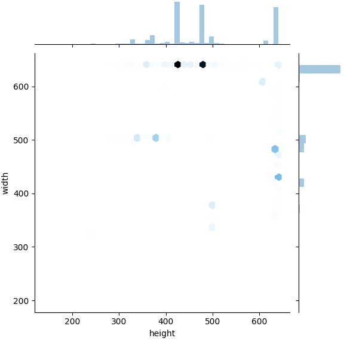
所有图像shape比例(宽/高)的一维分布
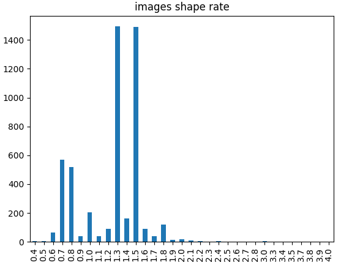

## 2.4 统计目标检测标注框信息

使用json_AnnoSta.py，可以从`instances_val2017.json`中，快速提取图像信息，生成csv表格，并生成统计图

### 2.4.1 命令演示

可以执行如下命令，打印`instances_val2017.json`信息

```
python ./coco_tools/json_AnnoSta.py \
    --json_path=./annotations/instances_val2017.json \
    --csv_path=./anno_sta/annos.csv \
    --png_shape_path=./anno_sta/annos_shape.png \
    --png_shapeRate_path=./anno_sta/annos_shapeRate.png \
    --png_pos_path=./anno_sta/annos_pos.png \
    --png_posEnd_path=./anno_sta/annos_posEnd.png \
    --png_cat_path=./anno_sta/annos_cat.png \
    --png_objNum_path=./anno_sta/annos_objNum.png \
    --get_relative=True
```

### 2.4.2 参数说明


| 参数名               | 含义                                                                                                                    | 默认值      |
| ---------------------- | ------------------------------------------------------------------------------------------------------------------------- | ------------- |
| --json_path          | (可选)需要统计的json文件路径                                                                                            |             |
| --csv_path           | (可选)统计表格保存路径                                                                                                  | None        |
| --png_shape_path     | (可选)png图片保存路径，图片内容为所有目标检测框shape的二维分布                                                          | None        |
| --png_shapeRate_path | (可选)png图片保存路径，图片内容为所有目标检测框shape比例(宽/高)的一维分布                                               | None        |
| --png_pos_path       | (可选)png图片保存路径，图片内容为所有目标检测框左上角坐标的二维分布                                                     | None        |
| --png_posEnd_path    | (可选)png图片保存路径，图片内容为所有目标检测框右下角坐标的二维分布                                                     | None        |
| --png_cat_path       | (可选)png图片保存路径，图片内容为各个类别的对象数量分布                                                                 | None        |
| --png_objNum_path    | (可选)png图片保存路径，图片内容为单个图像中含有标注对象的数量分布                                                       | None        |
| --get_relative       | (可选)是否生成图像目标检测框shape、目标检测框左上角坐标、右下角坐标的相对比例值<br />(横轴坐标/图片长，纵轴坐标/图片宽) | None        |
| --image_keyname      | (可选)json文件中，图像key的名称                                                                                         | images      |
| --anno_keyname       | (可选)json文件中，图像anno的名称                                                                                        | annotations |
| --Args_show          | (可选)是否打印输入的参数信息                                                                                            | True        |

### 2.4.3 结果展示

执行上述命令后，输出结果如下：

```
------------------------------------------------Args------------------------------------------------
json_path = ./annotations/instances_val2017.json
csv_path = ./anno_sta/annos.csv
png_shape_path = ./anno_sta/annos_shape.png
png_shapeRate_path = ./anno_sta/annos_shapeRate.png
png_pos_path = ./anno_sta/annos_pos.png
png_posEnd_path = ./anno_sta/annos_posEnd.png
png_cat_path = ./anno_sta/annos_cat.png
png_objNum_path = ./anno_sta/annos_objNum.png
get_relative = True
image_keyname = images
anno_keyname = annotations
Args_show = True

json read...

make dir: ./anno_sta
png save to ./anno_sta/annos_shape.png
png save to ./anno_sta/annos_shape_Relative.png
png save to ./anno_sta/annos_shapeRate.png
png save to ./anno_sta/annos_pos.png
png save to ./anno_sta/annos_pos_Relative.png
png save to ./anno_sta/annos_posEnd.png
png save to ./anno_sta/annos_posEnd_Relative.png
png save to ./anno_sta/annos_cat.png
png save to ./anno_sta/annos_objNum.png
csv save to ./anno_sta/annos.csv
```

部分表格内容：

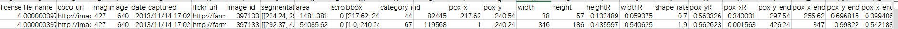

所有目标检测框shape的二维分布:

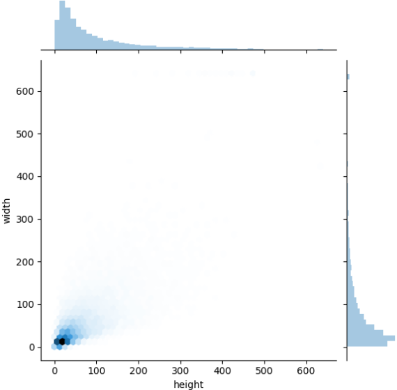

所有目标检测框shape在图像中相对比例的二维分布:

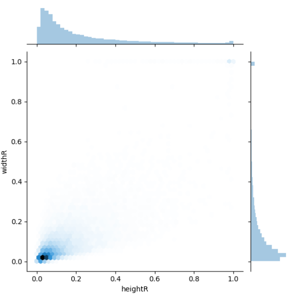

所有目标检测框shape比例（宽/高）的一维分布:

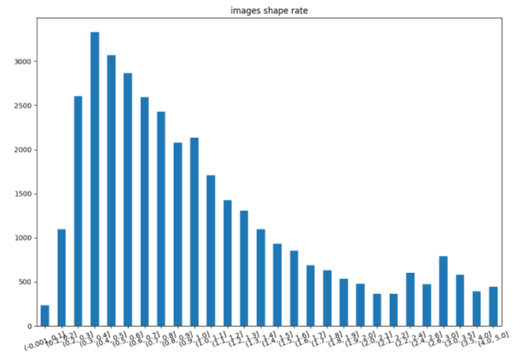

所有目标检测框左上角坐标的二维分布:

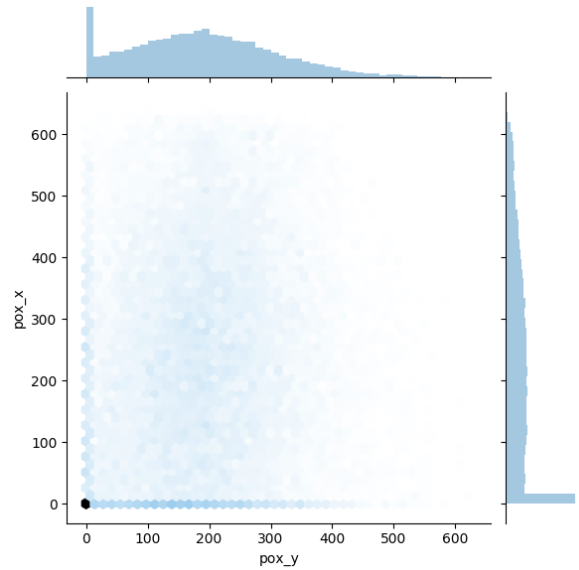

所有目标检测框左上角坐标的相对比例值的二维分布:

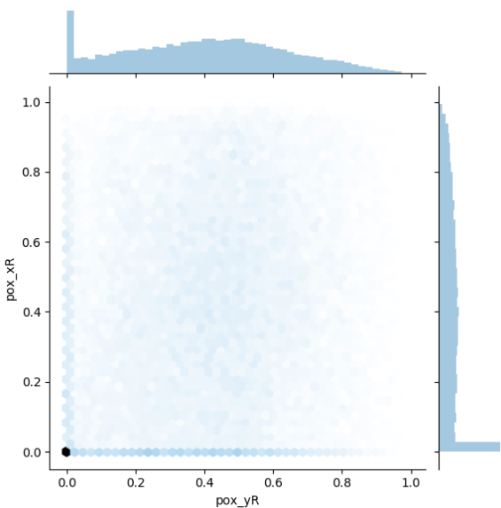

所有目标检测框右下角坐标的二维分布:

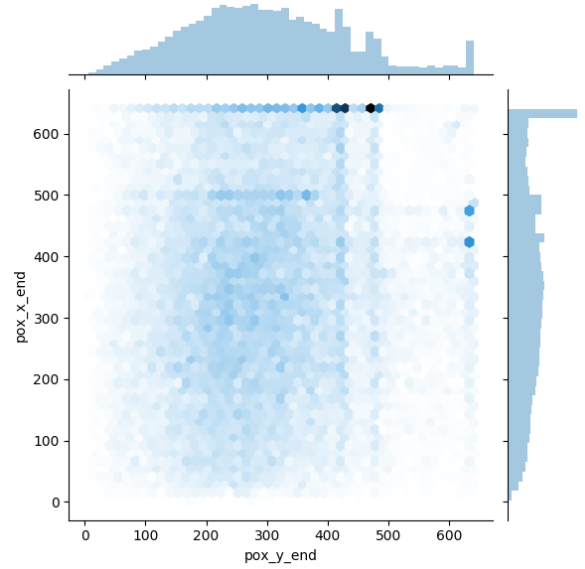

所有目标检测框右下角坐标的相对比例值的二维分布:

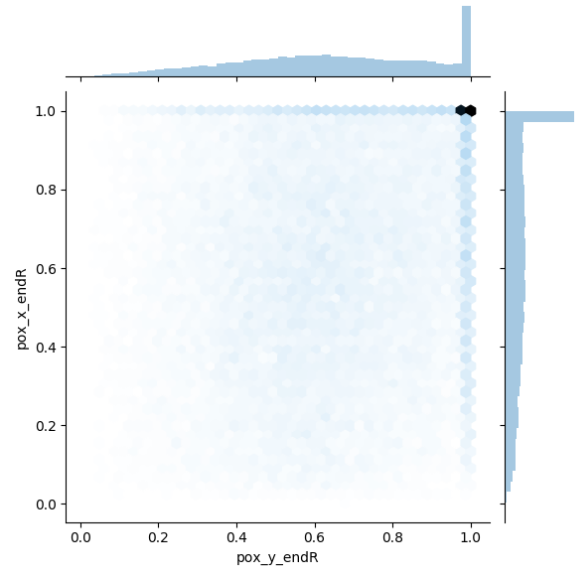

各个类别的对象数量分布

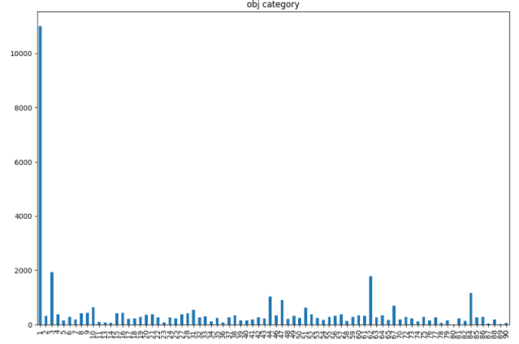

单个图像中含有标注对象的数量分布

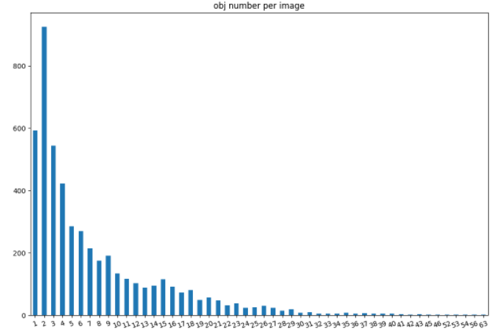

## 2.5 统计图像信息生成json

使用json_Test2Json.py，可以根据`test2017`中的文件信息与训练集json文件，快速提取图像信息，生成json文件

### 2.5.1 命令演示

可以执行如下命令，统计并生成`test2017`信息

```
python ./coco_tools/json_Img2Json.py \
    --test_image_path=./test2017 \
    --json_train_path=./annotations/instances_val2017.json \
    --json_test_path=./test.json
```

### 2.5.2 参数说明


| 参数名            | 含义                                   | 默认值     |
| ------------------- | ---------------------------------------- | ------------ |
| --test_image_path | 需要统计的图像文件夹路径               |            |
| --json_train_path | 用于参考的训练集json文件路径           |            |
| --json_test_path  | 生成的测试集json文件路径               |            |
| --image_keyname   | (可选)json文件中，图像key的名称        | images     |
| --cat_keyname     | (可选)json文件中，图像categories的名称 | categories |
| --Args_show       | (可选)是否打印输入的参数信息           | True       |

### 2.5.3 结果展示

执行上述命令后，输出结果如下：

```
------------------------------------------------Args------------------------------------------------
test_image_path = ./test2017
json_train_path = ./annotations/instances_val2017.json
json_test_path = ./test.json
Args_show = True

----------------------------------------------Get Test----------------------------------------------

json read...

test image read...
100%|█████████████████████████████████████| 40670/40670 [06:48<00:00, 99.62it/s]

 total test image: 40670
```

生成的json文件信息：

```
------------------------------------------------Args------------------------------------------------
json_path = ./test.json
show_num = 5
Args_show = True

------------------------------------------------Info------------------------------------------------
json read...
json keys: dict_keys(['images', 'categories']) 

**********************images**********************
 Content Type: list
 Total Length: 40670
 First 5 record:

{'id': 0, 'width': 640, 'height': 427, 'file_name': '000000379269.jpg'}
{'id': 1, 'width': 640, 'height': 360, 'file_name': '000000086462.jpg'}
{'id': 2, 'width': 640, 'height': 427, 'file_name': '000000176710.jpg'}
{'id': 3, 'width': 640, 'height': 426, 'file_name': '000000071106.jpg'}
{'id': 4, 'width': 596, 'height': 640, 'file_name': '000000251918.jpg'}
...
...

********************categories********************
 Content Type: list
 Total Length: 80
 First 5 record:

{'supercategory': 'person', 'id': 1, 'name': 'person'}
{'supercategory': 'vehicle', 'id': 2, 'name': 'bicycle'}
{'supercategory': 'vehicle', 'id': 3, 'name': 'car'}
{'supercategory': 'vehicle', 'id': 4, 'name': 'motorcycle'}
{'supercategory': 'vehicle', 'id': 5, 'name': 'airplane'}
...
...
```

## 2.6 json文件拆分

使用json_Split.py，可以拆分`instances_val2017.json`文件

### 2.6.1 命令演示

可以执行如下命令，拆分`instances_val2017.json`文件

```
python ./coco_tools/json_Split.py \
    --json_all_path=./annotations/instances_val2017.json \
    --json_train_path=./instances_val2017_train.json \
    --json_val_path=./instances_val2017_val.json
```

### 2.6.2 参数说明


| 参数名             | 含义                                                                                | 默认值     |
| -------------------- | ------------------------------------------------------------------------------------- | ------------ |
| --json_all_path    | 需要拆分的json文件路径                                                              |            |
| --json_train_path  | 生成的train部分json文件                                                             |            |
| --json_val_path    | 生成的val部分json文件                                                               |            |
| --val_split_rate   | (可选)拆分过程中，val集文件的比例                                                   | 0.1        |
| --val_split_num    | (可选)拆分过程中，val集文件的数量，<br />如果设置了该参数，则val_split_rate参数失效 | None       |
| --keep_val_inTrain | (可选)拆分过程中，是否在train中仍然保留val部分                                      | False      |
| --image_keyname    | (可选)json文件中，图像key的名称                                                     | images     |
| --cat_keyname      | (可选)json文件中，图像categories的名称                                              | categories |
| --Args_show        | (可选)是否打印输入的参数信息                                                        | True       |

### 2.6.3 结果展示

执行上述命令后，输出结果如下：

```
------------------------------------------------Args------------------------------------------------
json_all_path = ./annotations/instances_val2017.json
json_train_path = ./instances_val2017_train.json
json_val_path = ./instances_val2017_val.json
val_split_rate = 0.1
val_split_num = None
keep_val_inTrain = False
image_keyname = images
anno_keyname = annotations
Args_show = True

-----------------------------------------------Split------------------------------------------------

json read...

image total 5000, train 4500, val 500
anno total 36781, train 33119, val 3662
```

## 2.7 json文件合并

使用json_Merge.py，可以合并`instances_train2017.json、instances_val2017.json`文件

### 2.7.1 命令演示

可以执行如下命令，合并`instances_train2017.json、instances_val2017.json`文件

```
python ./coco_tools/json_Merge.py \
    --json1_path=./annotations/instances_train2017.json \
    --json2_path=./annotations/instances_val2017.json \
    --save_path=./instances_trainval2017.json
```

### 2.7.2 参数说明


| 参数名       | 含义                          | 默认值                    |
| -------------- | ------------------------------- | --------------------------- |
| --json1_path | 需要合并的json文件1路径       |                           |
| --json2_path | 需要合并的json文件2路径       |                           |
| --save_path  | 生成的json文件                |                           |
| --merge_keys | (可选)合并过程中需要合并的key | ['images', 'annotations'] |
| --Args_show  | (可选)是否打印输入的参数信息  | True                      |

### 2.7.3 结果展示

执行上述命令后，输出结果如下：

```
------------------------------------------------Args------------------------------------------------
json1_path = ./annotations/instances_train2017.json
json2_path = ./annotations/instances_val2017.json
save_path = ./instances_trainval2017.json
merge_keys = ['images', 'annotations']
Args_show = True

-----------------------------------------------Merge------------------------------------------------

json read...

json merge...
info
licenses
images merge!
annotations merge!
categories

json save...

finish!
```
