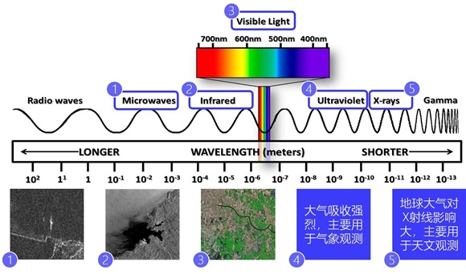
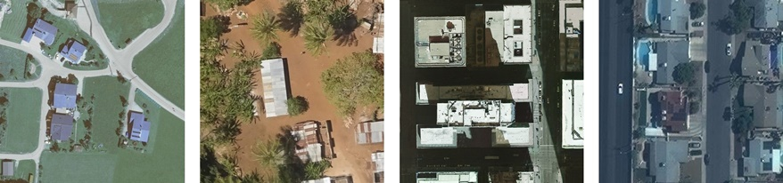
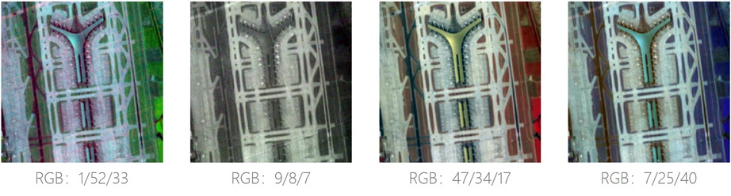
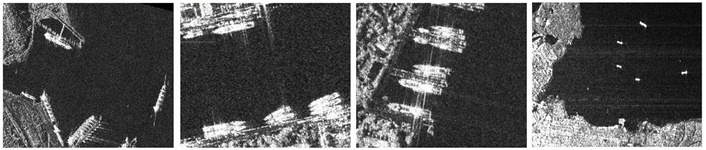

[简体中文](rs_data_cn.md) | English

# Introduction to Remote Sensing Data

## 1 Concepts of Remote Sensing and Remote Sensing Images

In a broad sense, remote sensing refers to *remote perception*, that is, the remote detection and perception of objects or natural phenomena without direct contact. Remote sensing in the narrow sense generally refers to electromagnetic wave remote sensing technology, that is, the process of detecting electromagnetic wave reflection characteristics by using sensors on a certain platform (such as aircraft or satellite) and extracting information from it. The image data from this process is known as remote sensing imagery, which generally includes satellite and aerial imagery. Remote sensing data are widely used in GIS tasks such as spatial analysis, as well as computer vision (CV) fields including scene classification, image segmentation, and object detection.

Compared with aerial images, satellite images cover a wider area, so they are used more broadly. Satellite images may be taken by commercial satellites or come from open databases of agencies such as NASA and ESA.

## 2 Characteristics of Remote Sensing Images

Remote sensing technology has the characteristics of macroscopic, multi-band, periodic, and economic. Macroscopic refers to that the higher the remote sensing platform is, the wider the perspective will be, and the wider the ground can be detected. The multi-band property means that the sensor can detect and record information in different bands, such as ultraviolet, visible light, near infrared, and microwave. Periodic means that the remote sensing satellite has the characteristic of acquiring images repeatedly in a certain period, which can carry out repeated observation of the same area in a short time. Economic means that remote sensing technology can be used as a way to obtain information on large area of ground surface without spending too much manpower and material resources.

The characteristics of remote sensing technology determine that the remote sensing image has the following characteristics:

1. Large scale. A remote sensing image can cover a vast surface area.
2. Multi-spectral. Compared with natural images, remote sensing images often have a larger number of bands.
3. Rich data sources. Different sensors and different satellites can provide a variety of data sources.

## 3 Concept of Raster Image and Imaging Principle of Remote Sensing Image

In order to introduce the imaging principle of remote sensing image, the concept of raster should be introduced first. Raster is a pixel-based data format that effectively represents continuous surfaces. The information in the raster is stored in a grid structure, and each information unit or pixel has the same size and shape, but different values. Digital photographs, orthophoto images and satellite images can all be stored in this format.

Raster formats are ideal for analysis that concentrates on spatial and temporal changes, because each data value has a grid-based accessible location. This allows us to access the same geographic location in two or more different grids and compare their values.

When the earth observation satellite takes a picture, the sensor will record the DN (Digital Number) value of different wavelength electromagnetic wave in the grid pixel. Through DN, the irradiance and reflectance of ground objects can be inversely calculated. The relationship between them is shown in the following formula, where $gain$ and $bias$ refer to the gain and offset of the sensor respectively; $L$ is irradiance, also known as radiant brightness value; $\rho$ is the reflectance of ground objects; $d_{s}$, $E_{0}$ and $\theta$ respectively represent the distance between solar and earth astronomical units, solar irradiance, and solar zenith angle.

$$
L = gain * DN + bias \\
\rho = \pi Ld^{2}_{s}/(E_{0}\cos{\theta})
$$

The electromagnetic spectrum is the result of human beings according to the order of wave length or frequency, wave number, energy, etc. The human eye perceives only a small range of wavelengths in the electromagnetic spectrum, known as visible light, in the range of 0.38-0.76μm. This is because our vision system evolved to be most sensitive where the sun emits the most light, and is broadly limited to the wavelengths that make up what we call red, green, and blue. In contrast, satellite sensors can sense a much wider range of the electromagnetic spectrum, which allows us to sense a much wider range of the spectrum with the help of sensors.

The electromagnetic spectrum is so wide that it is not possible to use a single sensor to collect information at all wavelengths at once. In practice, different sensors give priority to collecting information from different wavelengths of the spectrum. Each part of the spectrum captured and classified by the sensor is categorized as an information strip. The tape varies in size and can be compiled into different types of composite images, each emphasizing different physical properties. At the same time, most remote sensing images are 16-bit images, different from the traditional 8-bit images, which can represent finer spectral information.

## 4 Types of Remote Sensing Images

Remote sensing images have the characteristics of wide coverage area, large number of bands and rich sources. There are various types of remote sensing images. For example, remote sensing images can be divided into low-resolution remote sensing images, medium-resolution remote sensing images, and high-resolution remote sensing images, according to spatial resolution. According to the number of bands, it can be divided into multi-spectral image, hyperspectral image, panchromatic image, and other types. This document is intended to provide a quick guide for developers who do not have a background in remote sensing. Therefore, only a few common types of remote sensing images are introduced.

### 4.1 RGB Image

RGB images are similar to common natural images in daily life. The features displayed in RGB images are also in line with human visual common sense (for example, trees are green, cement is gray, etc.), and the three channels represent red, green, and blue, respectively. The figure below shows an RGB remote sensing image:

Since the data processing pipelines of most CV tasks are designed based on natural images, remote sensing data sets of RGB type are widely used in CV field.

### 4.2 MSI/HSI Image

MSI (multi-spectral image) and HSI (hyperspectral image) usually consist of several to hundreds of bands. The two are distinguished by different spectral resolution (*spectral resolution refers to the value of a specific wavelength range in the electromagnetic spectrum that can be recorded by the sensor; the wider the wavelength range, the lower the spectral resolution*). Usually the spectral resolution in the order of 1/10 of the wavelength is called multispectral. MSI has fewer bands, wider band, and higher spatial resolution, while HSI has more bands, narrower bands, and higher spectral resolution. However, HSI has more bands, narrower bands, and higher spectral resolution.

In practice, some specific bands of MSI/HSI are often selected according to application demands: For example, the transmittance of mid-infrared band is 60%-70%, including ground object reflection and emission spectrum, which can be used to detect high temperature targets such as fire. The red-edge band (*the point where the reflectance of green plants increases fastest between 0.67μm and 0.76μm, and is also the inflection point of the first derivative spectrum in this region*) is a sensitive band indicating the growth status of green plants. It can effectively monitor the growth status of vegetation and be used to study plant nutrients, health monitoring, vegetation identification, physiological, and biochemical parameters, etc.

The following gives an example to briefly introduce the concepts of band combination, spectral curve, and band selection commonly used in MSI/HSI processing, based on an hyperspectral image of Beijing Daxing Airport taken by Tiangong-1. In this image, bands with low signal-to-noise ratio and information entropy were eliminated based on the evaluation results, and some bands were eliminated based on the actual visual results of the image. A total of 54 visible near-infrared spectrum segments, 52 short-wave infrared spectrum segments, and the whole chromatographic segment data were retained.

**Band Combination**

Band combination refers to the result obtained by selecting three bands in MSI/HSI to replace the three RGB channels. *If the result is synthesized using the real RGB bands, it is called a true color image. Otherwise, it is called a false color image.* The combination of different bands can highlight different features of ground objects. The following figure shows the visual effects of several different combinations:

**Spectral Curve Interpretation**

Spectral information can often reflect the features of ground objects, and different bands reflect different features of ground objects. Spectral curves can be drawn by taking the wavelength or frequency of electromagnetic wave as the horizontal axis and the reflectance as the vertical axis. Taking the spectral curve of vegetation as an example, as shown in the figure below, the reflectance of vegetation is greater than 40% in the band of 0.8μm, which is significantly greater than that of about 10% in the band of 0.6μm, so more radiation energy is reflected during imaging. As shown in the image, the vegetation appears brighter in the 0.8μm image.

**Band Selection**

MSI/HSI may contain a larger number of bands. For one thing, not all bands are suitable for the task at hand; on the other hand, too many bands may bring heavy resource burden. In practical applications, partial bands of MSI/HSI can be selected according to the requirements to complete the task, and methods such as PCA and wavelet transform can also be used to reduce the dimension of MSI/HSI, so as to reduce redundancy and save computing resources.

### 4.3 SAR Image

Synthetic Aperture Radar (SAR) refers to active side-looking radar systems. The imaging geometry of SAR belongs to the slant projection type, so SAR images and optical images have great differences in imaging mechanism, geometric features, radiation features, and other aspects.

The information of different bands in optical images comes from the reflected energy of electromagnetic waves of different wavelengths, while SAR images record echo information of different polarizations (*that is, the vibration direction of electromagnetic wave transmission and reception*) in binary and complex forms. Based on the recorded complex data, the original SAR image can be transformed to extract the corresponding amplitude and phase information. Human beings cannot directly distinguish the phase information, but they can intuitively perceive the amplitude information, and intensity images can be obtained by using the amplitude information, as shown in the figure below:

Due to the special imaging mechanism of SAR images, its resolution is relatively low, and the signal-to-noise ratio is also low, so the amplitude information contained in SAR images is much less than the optical image. This is why SAR images are rarely used in the CV field. It is worth mentioning that SAR has its unique advantages in some application scenarios due to its long wavelength and cloud and surface penetration ability.

### 4.4 RGBD Image

The difference between RGBD images and RGB images is that there is an extra D channel in RGBD images, namely the depth. Depth images are similar to grayscale images, except that each pixel value represents the actual distance of the sensor from the object. Generally, RGB data and depth data in RGBD images are registered with each other. Depth images provide height information that RGB images do not have, and can distinguish some ground objects with similar spectral characteristics in downstream tasks.

## 5 Preprocessing of Remote Sensing Image

Compared with natural images, the preprocessing of remote sensing images is rather complicated. Specifically, it can be divided into the following steps:

1. **Radiometric Calibration**: The DN is converted into radiation brightness value or reflectivity and other physical quantities.
2. **Atmospheric Correction**: The radiation error caused by atmospheric influence is eliminated and the real surface reflectance of surface objects is retrieved. This step together with radiometric calibration is called **Radiometric Correction**.
3. **Orthographic Correction**: The oblique correction and projection difference correction were carried out at the same time, and the image was resampled to orthophoto.
4. **Image Registration**: Match two or more images taken at different times, from different sensors (imaging equipments) or under different conditions (weather, illumination, camera position, angle, etc.).
5. **Image Fusion**: The image data of the same object collected by multiple source channels are synthesized into high quality image.
6. **Image Clipping**: The large remote sensing image was cut into small pieces to extract the region of interest.
7. **Define Projection**: Define a geographic coordinate system on the data.

It should be noted that in practical application, the above steps are not all necessary, and some of them can be performed selectively according to needs.

## Reference Material

- [Remote Sensing in Wikipedia](https://en.wikipedia.org/wiki/Remote_sensing).
- [Introduction to Surveying and Mapping by Ning Jinsheng et al.](https://book.douban.com/subject/3116967/).
- [Principles and Applications of Remote Sensing by Sun Jia-liu.](https://book.douban.com/subject/3826668/).
- [Steps of Remote Sensing Image Preprocessing](https://blog.csdn.net/qq_35093027/article/details/119808941).
