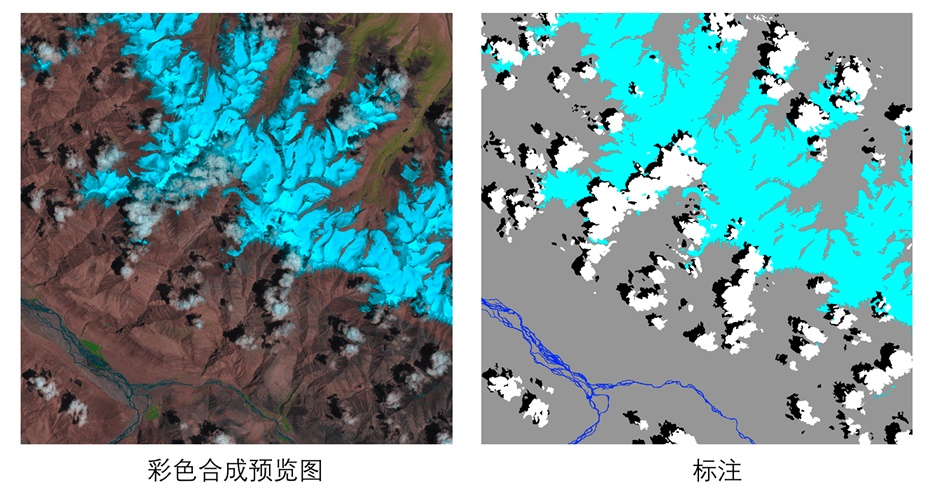

# 遥感数据集

遥感影像的格式多种多样，不同传感器产生的数据格式也可能不同。PaddleRS至少兼容以下6种格式图片读取：

- `tif`
- `png`, `jpeg`, `bmp`
- `img`
- `npy`

标注图要求必须为单通道的png格式图像，像素值即为对应的类别，像素标注类别需要从0开始递增。例如0，1，2，3表示有4种类别，255用于指定不参与训练和评估的像素，标注类别最多为256类。

## L8 SPARCS数据集
[L8 SPARCS公开数据集](https://www.usgs.gov/land-resources/nli/landsat/spatial-procedures-automated-removal-cloud-and-shadow-sparcs-validation)进行云雪分割，该数据集包含80张卫星影像，涵盖10个波段。原始标注图片包含7个类别，分别是`cloud`, `cloud shadow`, `shadow over water`, `snow/ice`, `water`, `land`和`flooded`。由于`flooded`和`shadow over water`2个类别占比仅为`1.8%`和`0.24%`，我们将其进行合并，`flooded`归为`land`，`shadow over water`归为`shadow`，合并后标注包含5个类别。

数值、类别、颜色对应表：

|Pixel value|Class|Color|
|---|---|---|
|0|cloud|white|
|1|shadow|black|
|2|snow/ice|cyan|
|3|water|blue|
|4|land|grey|

<p align="center">
 


<p align='center'>
 L8 SPARCS数据集示例
</p>

执行以下命令下载并解压经过类别合并后的数据集：
```shell script
mkdir dataset && cd dataset
wget https://paddleseg.bj.bcebos.com/dataset/remote_sensing_seg.zip
unzip remote_sensing_seg.zip
cd ..
```
其中`data`目录存放遥感影像，`data_vis`目录存放彩色合成预览图，`mask`目录存放标注图。
