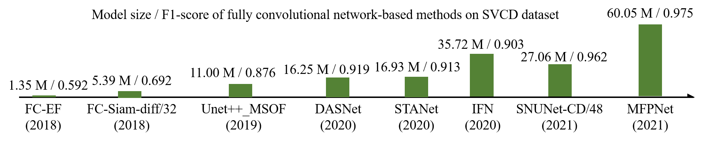

# PaddleRS科研实战：设计深度学习变化检测模型

本案例演示如何使用PaddleRS设计变化检测模型，并开展消融实验和对比实验。

## 1 环境配置

根据[教程](https://github.com/PaddlePaddle/PaddleRS/tree/develop/tutorials/train#环境准备)安装PaddleRS及相关依赖。在本项目中，GDAL库并不是必需的。

配置好环境后，在PaddleRS仓库根目录中执行如下指令切换到本案例所在目录：

```shell
cd examples/rs_research
```

## 2 数据准备

本案例在[LEVIR-CD数据集](https://www.mdpi.com/2072-4292/12/10/1662)[1]和[synthetic images and real season-varying remote sensing images（SVCD）数据集](https://www.int-arch-photogramm-remote-sens-spatial-inf-sci.net/XLII-2/565/2018/isprs-archives-XLII-2-565-2018.pdf)[2]上开展实验。请在[LEVIR-CD数据集下载链接](https://justchenhao.github.io/LEVIR/)和[SVCD数据集下载链接](https://drive.google.com/file/d/1GX656JqqOyBi_Ef0w65kDGVto-nHrNs9/edit)分别下载这两个数据集，解压至本地目录，并执行如下指令：

```shell
mkdir data/
python ../../tools/prepare_dataset/prepare_levircd.py \
    --in_dataset_dir {LEVIR-CD数据集存放目录路径} \
    --out_dataset_dir "data/levircd" \
    --crop_size 256 \
    --crop_stride 256
python ../../tools/prepare_dataset/prepare_svcd.py \
    --in_dataset_dir {SVCD数据集存放目录路径} \
    --out_dataset_dir "data/svcd"
```

以上指令利用PaddleRS提供的数据集准备工具完成数据集切分、file list创建等操作。具体而言，对于LEVIR-CD数据集，使用官方的训练/验证/测试集划分，并将原始的`1024x1024`大小的影像切分为无重叠的`256x256`的小块（参考[3]中的做法）；对于SVCD数据集，使用官方的训练/验证/测试集划分，不做其它额外处理。

## 3 模型设计与验证

### 3.1 问题分析与思路拟定

随着深度学习技术应用的不断深入，近年来，变化检测领域涌现了许多基于全卷积神经网络（fully convolutional network, FCN）的遥感影像变化检测算法。与基于特征和基于影像块的方法相比，基于FCN的方法具有处理效率高、依赖超参数少等优势，但其缺点在于参数量往往较大，因而对训练样本的数量更为依赖。尽管中、大型变化检测数据集的数量与日俱增，训练样本日益丰富，但深度学习变化检测模型的参数量也越来越大。下图显示了从2018年到2021年一些已发表的文献中提出的基于FCN的变化检测模型的参数量与其在SVCD数据集上取得的F1分数（柱状图中bar的高度与模型参数量成正比）：



诚然，增大参数数量在大多数情况下等同于增加模型容量，而模型容量的增加意味着模型拟合能力的提升，从而有助于模型在实验数据集上取得更高的精度指标。但是，“更大”一定意味着“更好”吗？答案显然是否定的。在实际应用中，“更大”的遥感影像变化检测模型常常遭遇如下问题：

1. 巨大的参数量意味着巨大的存储开销。在许多实际场景中，硬件资源往往是有限的，过多的模型参数将给部署造成困难。
2. 在数据有限的情况下，大模型更易遭受过拟合，其在实验数据集上看起来良好的结果也难以泛化到真实场景。

本案例认为，上述问题的根源在于参数量与数据量的失衡所导致的特征冗余。既然模型的特征存在冗余，是否存在某种手段，能够在固定模型参数量的前提下对特征进行优化，从而“榨取”小模型的更多潜力？基于这个观点，本案例的基本思路是设计一种基于网络迭代优化思想的深度学习变化检测算法。首先，构造一个轻量级的变化检测模型，并以其作为基础迭代单元。在每次迭代开始时，由上一次迭代输出的概率图以及原始的输入影像对构造新的输入，如此逐级实现coarse-to-fine优化。考虑到增加迭代单元的数量将使模型参数量成倍增加，在迭代过程中应始终复用同一迭代单元的参数以充分挖掘变化检测网络的拟合能力，迫使其学习到更加有效的特征。这一做法类似[循环神经网络](https://baike.baidu.com/item/%E5%BE%AA%E7%8E%AF%E7%A5%9E%E7%BB%8F%E7%BD%91%E7%BB%9C/23199490)。根据此思路可以绘制框图如下：


### 3.2 确定baseline模型

科研工作往往需要“站在巨人的肩膀上”，在前人工作的基础上做“增量创新”。因此，对模型设计类工作而言，选用一个合适的baseline模型至关重要。考虑到本案例的出发点是解决现有模型参数量过大、冗余特征过多的问题，并且在拟定的解决方案中使用到了循环结构，用作baseline的网络结构必须足够轻量和高效（因为最直接的思路是使用baseline作为基础迭代单元）。为此，本案例选用Bitemporal Image Transformer（BIT）作为baseline。BIT是一个轻量级的深度学习变化检测模型，其基本结构如图所示：


BIT的核心思想在于，

### 3.3 定义新模型

确定了基本思路和baseline模型之后，可以绘制如下的算法整体框图：


依据此框图，即可在。

#### 3.3.1 自定义模型组网

在`custom_model.py`中定义模型的宏观（macro）结构以及组成模型的各个微观（micro）模块。例如，当前`custom_model.py`中定义了迭代版本的BIT模型`IterativeBIT`：
```python
@attach
class IterativeBIT(nn.Layer):
    def __init__(self, num_iters=1, gamma=0.1, num_classes=2, bit_kwargs=None):
        super().__init__()

        if num_iters <= 0:
            raise ValueError(f"`num_iters` should have positive value, but got {num_iters}.")

        self.num_iters = num_iters
        self.gamma = gamma

        if bit_kwargs is None:
            bit_kwargs = dict()

        if 'num_classes' in bit_kwargs:
            raise KeyError("'num_classes' should not be set in `bit_kwargs`.")
        bit_kwargs['num_classes'] = num_classes

        self.bit = BIT(**bit_kwargs)

    def forward(self, t1, t2):
        rate_map = self._init_rate_map(t1.shape)

        for it in range(self.num_iters):
            # Construct inputs
            x1 = self._constr_iter_input(t1, rate_map)
            x2 = self._constr_iter_input(t2, rate_map)
            # Get logits
            logits_list = self.bit(x1, x2)
            # Construct rate map
            prob_map = F.softmax(logits_list[0], axis=1)
            rate_map = self._constr_rate_map(prob_map)

        return logits_list
    ...
```

在编写组网相关代码时请注意以下两点：

1. 所有模型必须为`paddle.nn.Layer`的子类；
2. 包含模型整体逻辑结构的最外层模块须用`@attach`装饰；
3. 对于变化检测任务，`forward()`方法除`self`参数外还接受两个参数`t1`、`t2`，分别表示第一时相和第二时相影像。

关于模型定义的更多细节请参考[文档](https://github.com/PaddlePaddle/PaddleRS/blob/develop/docs/dev/dev_guide.md)。

#### 3.3.2 自定义训练器

在`custom_trainer.py`中定义训练器。例如，当前`custom_trainer.py`中定义了与`IterativeBIT`模型对应的训练器：
```python
@attach
class IterativeBIT(BaseChangeDetector):
    def __init__(self,
                 num_classes=2,
                 use_mixed_loss=False,
                 losses=None,
                 num_iters=1,
                 gamma=0.1,
                 bit_kwargs=None,
                 **params):
        params.update({
            'num_iters': num_iters,
            'gamma': gamma,
            'bit_kwargs': bit_kwargs
        })
        super().__init__(
            model_name='IterativeBIT',
            num_classes=num_classes,
            use_mixed_loss=use_mixed_loss,
            losses=losses,
            **params)
```

在编写训练器定义相关代码时请注意以下两点：

1. 对于变化检测任务，训练器必须为`paddlers.tasks.cd.BaseChangeDetector`的子类；
2. 与模型一样，训练器也须用`@attach`装饰；
3. 训练器和模型可以同名。

在本案例中，仅仅重写了训练器的`__init__()`方法。在实际科研过程中，可以通过重写`train()`、`evaluate()`、`default_loss()`等方法定制更加复杂的训练、评估策略或更换默认损失函数。

关于训练器的更多细节请参考[API文档](https://github.com/PaddlePaddle/PaddleRS/blob/develop/docs/apis/train.md)。

### 3.4 进行参数分析与消融实验

#### 3.4.1 实验设置

#### 3.4.2 编写配置文件

#### 3.4.3 实验结果

### 3.5 \*Magic Behind

本小节涉及技术细节，对于本案例来说属于进阶内容，您可以选择性了解。

#### 3.5.1 延迟属性绑定

PaddleRS提供了，只需要。`attach_tools.Attach`对象自动。

#### 3.5.2 非侵入式轻量级配置系统

### 3.5 开展特征可视化实验

## 4 对比实验

### 4.1 确定对比算法

### 4.2 准备对比算法配置文件

### 4.3 实验结果

#### 4.3.1 LEVIR-CD数据集上的对比结果

#### 4.3.2 SVCD数据集上的对比结果

精度

## 5 总结与展望

### 5.1 总结

### 5.2 展望

- 本案例对所有参与比较的算法使用了相同的训练超参数，但由于模型之间存在差异，使用统一的超参训练往往难以保证所有模型都能取得较好的效果。在后续工作中，可以对每个对比算法进行调参，使其获得最优精度。
- 在评估算法效果时，仅仅对比了精度指标，而未对耗时、模型大小、FLOPs等指标进行考量。后续应当从精度和性能两个方面对算法进行综合评估。

## 参考文献

> [1] Chen, Hao, and Zhenwei Shi. "A spatial-temporal attention-based method and a new dataset for remote sensing image change detection." *Remote Sensing* 12.10 (2020): 1662.  
[2] Lebedev, M. A., et al. "CHANGE DETECTION IN REMOTE SENSING IMAGES USING CONDITIONAL ADVERSARIAL NETWORKS." *International Archives of the Photogrammetry, Remote Sensing & Spatial Information Sciences* 42.2 (2018).  
[3] Chen, Hao, Zipeng Qi, and Zhenwei Shi. "Remote sensing image change detection with transformers." *IEEE Transactions on Geoscience and Remote Sensing* 60 (2021): 1-14.  
[4] Daudt, Rodrigo Caye, Bertr Le Saux, and Alexandre Boulch. "Fully convolutional siamese networks for change detection." *2018 25th IEEE International Conference on Image Processing (ICIP)*. IEEE, 2018.  
